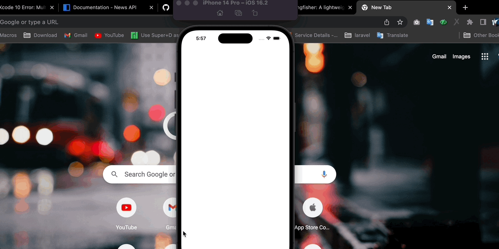

# Documentation for using source code Article News Roby

This application uses api.org news with category, country, sources, language filter features, implement rxsswift for create infinite scroll


## Acknowledgements

- [Documentation news api.orgk](https://newsapi.org/docs)
 - [Implementation library rxswift in this project](https://github.com/ReactiveX/RxSwift)
 - [Library for downloading and caching article image](https://github.com/onevcat/Kingfisher)


## Authors

- [@robysetiawan2409@gmail.com]

  


## Demo

these example looks like sdk on running app demo, on plugin (flutter or react native) or apps
<table>
 <tr>
    <th>Home page</th>
    <th>Source page</th>
    <th>Article page</th>
    <th>Webview </th>
 </tr>
 <tr>
    <td></td>
    <td></td>
    <td></td>
    <td></td>
 </tr>
</table>


## Requirements
- iOS 13.0+

- Xcode 11.2+

- Swift 5.0+

- CocoaPods 1.6.1+

  

## Features

- blur apps
- real time peek detection
- Fullscreen view or flexible size view from app will be blur
- autoblur and disable auto blur


## Running App

1. To run the example project on sdk, run pod install from the root directory folder

for apple sillicon

```
arch -x86_64 pod install
```

for intel

```
pod install
```

2. configuration apikey for `get data from news api`, create file and name it  **AppInsightsArticleNews.cpp** on folder the same path **AppInsightsArticleNews.h,** and write file with this

```
#include "AppInsightsArticleNews.hpp"

std::string AppInsightsArticleNews::generateAkl() {
    return "api key for news api";
}
```

